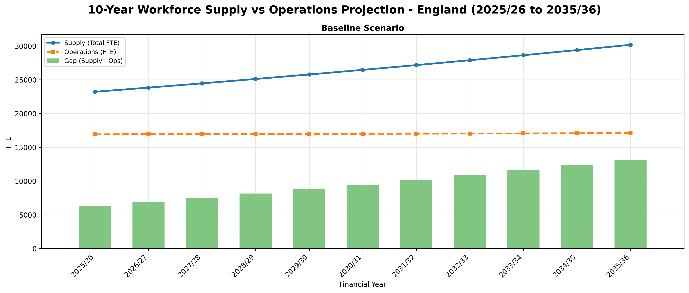

# community-pharmacy-workforce-with-open-data
This workforce projection model supports NHS workforce planning for community pharmacy services, with a focus on two GPhC-regulated professions: pharmacists and pharmacy technicians.

**Usage:**
```bash
# Run with default baseline scenario
python src/main.py

# Run with optimistic scenario
python src/main.py optimistic

# Run with pessimistic scenario
python src/main.py pessimistic
```

## Folder Structure

```
community-pharmacy-workforce-with-open-data/
├── data/                          # Data files
│   ├── cpws.py
│   ├── gphc-total-number-of-pharmacy-registrants.csv
│   ├── gphc-registrants-joiners.csv
│   ├── gphc-registrants-leavers.csv
│   └── nhsbsa-pharmacy-england-hrs.py
├── src/                           # Source code
│   ├── config.py                 # Configuration settings
│   ├── input_data.py              # Data loading and preprocessing
│   ├── main.py                    # Main entry point for projections
│   ├── project_workforce.py      # Workforce projection functions
│   ├── utils.py                   # Utility functions
│   └── visualize_projections.py   # Visualization functions
├── LICENSE
├── workforce_projection_chart.png # Generated visualization output
├── README.md
└── requirements.txt

```

## Data sources

- Baseline: [Community Pharmacy Workforce Survey (CPWS)](https://www.data.gov.uk/dataset/09aa8f38-547a-46b7-a117-2cb710ad939b/)
    - **Unit**: Both Headcount and Full-time equivalent (FTE) figures are available
    - **Care setting**: High-street pharmacies only
    - **Survey data**: CPWS 2024 published on 27 June 2025
- Growth rates: [GPhC registers data](https://www.pharmacyregulation.org/about-us/publications-and-insights/research-data-and-insights/gphc-registers-data)
    - **Unit**: Headcount only (total number of registered professionals)
    - **Care setting**: All (Hospital, Community, Primary care, and Pharmacy sector)
    - **Snapshot data**: Annual snapshot data (March) for England from 2018 to 2025
    - **Growth rates**: Compound Annual Growth Rate (CAGR) calculated from 7-year historical data (2018-2025)
- Pharmacy operation hours: [NHSBSA Consolidated Pharmaceutical List](https://opendata.nhsbsa.net/dataset/consolidated-pharmaceutical-list)
    - **Data**: Total number of pharmacies and opening hours in England, available by financial year quarter (e.g., 2025/26 Q1)
    - **Care setting**: All NHS pharmacies, appliance contractors, and Local Pharmaceutical Services (LPS) contractors
    - **Example output (2025/26 Q1)**: 
        - Total number of pharmacies: 10,525
        - Total pharmacy operation hours (weekly): 546,264.13 hours
        - Average weekly hours per pharmacy: 51.92 hours

### Example Output

The model generates workforce projections and gap analysis visualizations:



The visualization shows 10-year supply vs operations projections with gap analysis for the selected scenario using a dual y-axis chart:
- **Left y-axis**: 
  - **Supply (Total FTE)**: Combined workforce supply (Pharmacist + Pharmacy Technician) as a line
  - **Operations (FTE)**: Workforce required for pharmacy operations as a line
- **Right y-axis**:
  - **Gap (Supply - Ops)**: Difference between supply and operations as bars (positive = surplus, negative = deficit)

```
    year financial_year  scenario  supply    ops    gap
0   2025        2025/26  baseline   23218  18009   5209
1   2026        2026/27  baseline   23834  18729   5105
2   2027        2027/28  baseline   24465  19478   4987
3   2028        2028/29  baseline   25114  20257   4857
4   2029        2029/30  baseline   25781  21067   4714
5   2030        2030/31  baseline   26466  21910   4556
6   2031        2031/32  baseline   27169  22786   4383
7   2032        2032/33  baseline   27892  23698   4194
8   2033        2033/34  baseline   28633  24646   3987
9   2034        2034/35  baseline   29395  25632   3763
10  2035        2035/36  baseline   30176  26658   3518
```

**Note**: The output values reflect:
- Updated workforce utilisation rate (accounts for 28 days training/sick leave)
- Pharmacy operations growth rate of 4% per year